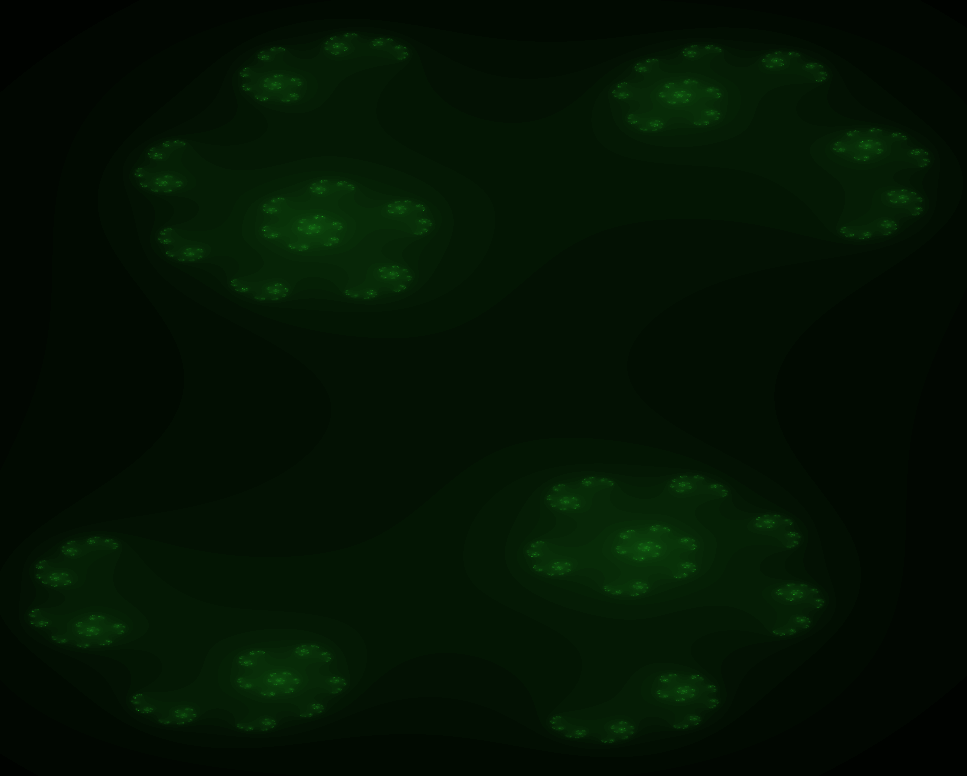
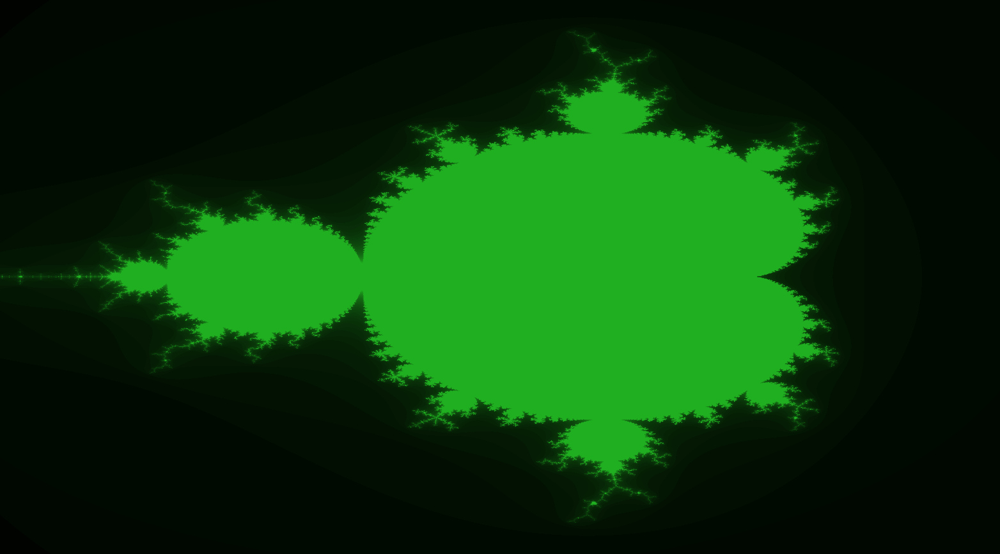

# Fract-ol: Generating fractals up to the precision limit.

## Julia fractal at c = 0.5 + 0.2i

## Mandelbrot set

## Words:

This project is about generating "infinite" fractals (using MLX42), or as infinite as we can get with precision limitations.

When I started this project, I did not understand what a complex number was; I barely understood imaginary numbers, but thankfully, after doing some research, you can completely ignore the words complex and imaginary, and it becomes a trivial problem. The complex plane is actually just a plane that uses floats, not difficult to understand. Then you can map screenspace coordinates to the complex plane via linear interpolation, simple enough. Then for each coordinate (pixel), you just perform a pre-defined equation until it reaches other pre-defined limits, stick that in a loop, return the depth (number of times it looped before it hit one of the limits), and use the depth to determine the colour of the pixel. Really it's not as "complex" or "imaginary" as it once seemed.

Scrolling into the fractal at the mouse position is also just taking the screenspace position of the mouse, mapping it to the complex plane, then using the ydelta of the scroll to determine whether it's scrolling in or out, then scaling the complex plane viewport by that amount. Oh yeah, and then recalculate every pixel.

I'm sure someone smarter than me probably has some mathsy trick up their sleeve to avoid the overhead of recalculating every pixel every time or some way to offset the overhead. I just skipped straight to threading it (see the threading branch).

## Usage

For the Mandelbrot set:
`./fractol mandelbrot`

For the Julia set:
`./fractol julia {c real part} {c imaginary part}`

## Controls

Scroll to zoom at the mouse position (inverted).
Shift + Scroll to increment/decrement max_depth.
Click and drag to move around the fractal.

# To Do:
- Protect inputs.
- Max depth shouldn't be float (and shouldnt go out of bounds)
- Input colour values at runtime & different colour modes
- add newton fractal options
- add arrow key movement for bonus (even though mouse movement is cooler)
- i have no idea what "make the colour range shift" means but i guess i'll figure that out.
- update threaded version with recent changes.